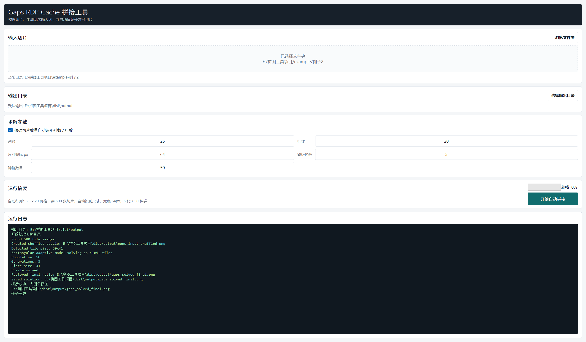

<p align="center">
  
</p>

<h1 align="center">PuzzleMender</h1>

<p align="center">
  <em>致力于 CTF 和电子数据取证拼图题的自动化恢复工具：面向 RDP Cache、碎片化图片切片与长方形拼图场景。</em>
</p>

<p align="center">
  
  
  
  
  
  
  
  
  
  
</p>

---

**CTF 拼图题 · 电子数据取证 · RDP Cache 切片恢复 · GUI + CLI 双入口 · 自动行列识别 · 长方形自适应 · 进度显示 · AI Agent Skill · 最终输出 `gaps_solved_final.png`**

## 项目简介

**PuzzleMender** 致力于解决 CTF 和电子数据取证中的拼图类题目：它可以把散乱的图片切片、RDP Cache 导出的碎片、长方形截图块重新整理并拼回完整图像，帮助更快还原关键画面、线索和证据。

项目提供 GUI 和 CLI 两种入口，支持自动行列识别、长方形自适应、进度显示、Windows exe 打包，以及面向 AI agent 的自动调用说明。

## 1. 输出文件

推荐始终设置输出目录。源码运行时默认输出到项目下的 `output`；exe 运行时如果没有指定输出目录，会输出到 exe 所在目录下的 `output`。

常见输出文件：

- `gaps_input_shuffled.png`：给 `gaps` 算法使用的临时乱序输入图。
- `gaps_solved_square.png`：长方形自适应模式下的正方形中间结果。
- `gaps_solved_final.png`：最终还原图，优先查看这个文件。

## 2. GUI 版本

源码运行：

```powershell
python gui_stitch.py
```

exe 运行：

```powershell
.\dist\gaps_stitch_gui.exe
```

GUI 会默认最大化打开。



基本流程：

1. 选择或拖入切片文件夹，支持 `.png` 和 `.bmp`。
2. 默认勾选“根据切片数量自动识别列数 / 行数”。
3. 确认输出目录，默认是 `output`，也可以手动选择。
4. 快速预览建议先用默认 `繁衍代数=5`、`种群数量=50`。
5. 点击“开始自动拼接”，进度条会显示当前阶段。

如果自动识别的行列不符合真实图像比例，取消勾选自动识别，然后手动填写列数和行数。

## 3. CLI 版本

源码运行：

```powershell
python run_gaps_stitch.py --folder "E:\tiles" --output-dir "E:\拼图工具项目\output"
```

exe 运行：

```powershell
.\dist\gaps_stitch_cli.exe --folder "E:\tiles" --output-dir "E:\拼图工具项目\output"
```

只使用环境变量运行：

```powershell
& $env:GAPS_STITCH_CLI
```

Linux 不能直接执行 Windows 打包出的 `.exe`。在 Linux 上让 AI agent 调用 CLI，推荐创建一个包装脚本：

```bash
sudo tee /usr/local/bin/gaps_stitch_cli >/dev/null <<'EOF'
#!/usr/bin/env bash
set -euo pipefail
cd /opt/puzzle-tool
exec python3 run_gaps_stitch.py "$@"
EOF
sudo chmod +x /usr/local/bin/gaps_stitch_cli
export GAPS_STITCH_CLI="/usr/local/bin/gaps_stitch_cli"
```

其中 `/opt/puzzle-tool` 要替换成 Linux 上项目源码所在目录，也就是包含 `run_gaps_stitch.py`、`puzzle_stitcher/` 和 `gaps/` 的目录。

自动行列模式默认开启，也可以显式指定：

```powershell
& $env:GAPS_STITCH_CLI `
  --folder $env:GAPS_STITCH_INPUT_DIR `
  --output-dir $env:GAPS_STITCH_OUTPUT_DIR `
  --auto-grid
```

手动行列：

```powershell
& $env:GAPS_STITCH_CLI `
  --folder "E:\tiles" `
  --output-dir "E:\out" `
  --manual-grid `
  --columns 25 `
  --rows 20
```

快速预览：

```powershell
& $env:GAPS_STITCH_CLI --generations 5 --population 50
```

更高质量但更慢：

```powershell
& $env:GAPS_STITCH_CLI --generations 20 --population 200
```

可复现乱序输入：

```powershell
& $env:GAPS_STITCH_CLI --seed 123
```

CLI 会输出类似：

```text
[###-------------------------]  10% 已扫描切片
[#######---------------------]  25% 已生成乱序输入图
[处理中] 算法求解中
[############################] 100% 完成
```

`[处理中] 算法求解中` 表示进入 `gaps` 内部求解阶段，不是卡死。几百张切片时这一段可能需要几分钟。

## 4. 环境变量

AI agent skill 要求用户先设置好下面三个环境变量：

```powershell
$env:GAPS_STITCH_CLI = "E:\拼图工具项目\dist\gaps_stitch_cli.exe"
$env:GAPS_STITCH_INPUT_DIR = "E:\tiles"
$env:GAPS_STITCH_OUTPUT_DIR = "E:\拼图工具项目\output"
```

永久设置，新开终端后生效：

```powershell
setx GAPS_STITCH_CLI "E:\拼图工具项目\dist\gaps_stitch_cli.exe"
setx GAPS_STITCH_INPUT_DIR "E:\tiles"
setx GAPS_STITCH_OUTPUT_DIR "E:\拼图工具项目\output"
```

可选环境变量：

| 变量 | 默认值 | 说明 |
| --- | --- | --- |
| `GAPS_STITCH_AUTO_GRID` | `1` | `1` 自动识别行列，`0` 手动行列。 |
| `GAPS_STITCH_COLUMNS` | `28` | 手动列数。 |
| `GAPS_STITCH_ROWS` | `16` | 手动行数。 |
| `GAPS_STITCH_SIZE` | `64` | 尺寸兜底值；实际切片尺寸会自动检测。 |
| `GAPS_STITCH_GENERATIONS` | `5` | 繁衍代数，至少为 `2`。 |
| `GAPS_STITCH_POPULATION` | `50` | 种群数量。 |
| `GAPS_STITCH_SEED` | 无 | 可选随机种子。 |

例如永久设置默认快速参数：

```powershell
setx GAPS_STITCH_AUTO_GRID "1"
setx GAPS_STITCH_GENERATIONS "5"
setx GAPS_STITCH_POPULATION "50"
```

## 5. 自动行列和长方形自适应

自动行列根据切片数量寻找最接近正方形的因数组合，并优先使用横向网格：

- `500` 张 -> `25 x 20`
- `448` 张 -> `28 x 16`
- 质数张 -> `N x 1`

长方形自适应自动开启，不需要额外参数。工具会检测每张切片尺寸：

1. 如果切片是正方形，直接交给 `gaps` 求解。
2. 如果切片是长方形，例如 `30x41`，先临时拉伸成 `41x41` 的正方形块。
3. 求解完成后，把最终图恢复为原始比例。
4. 最终结果始终看 `gaps_solved_final.png`。

## 6. 打包 exe

打包脚本：

```powershell
.\scripts\build_exes.ps1
```

成功后生成：

```text
dist\gaps_stitch_cli.exe
dist\gaps_stitch_gui.exe
```

打包前建议先跑测试：

```powershell
python -m pytest
```

如果 PyInstaller 报错：

```text
The 'pathlib' package is an obsolete backport...
```

说明当前 Python 环境安装了过时的 `pathlib` 回包，修复：

```powershell
python -m pip uninstall pathlib
.\scripts\build_exes.ps1
```

## 7. AI Agent Skill

项目提供一个可直接给 AI agent 使用的 Skill 包：

```text
skills/gaps-stitch-cli/
└── SKILL.md
```

这个 Skill 只负责教 agent 如何调用 PuzzleMender CLI，不包含模型、不包含密钥。安装后，用户仍然要先配置好 `GAPS_STITCH_CLI`、`GAPS_STITCH_INPUT_DIR`、`GAPS_STITCH_OUTPUT_DIR`。

### 7.1 原生 Skill 型 Agent

如果你的 agent 支持 `SKILL.md` / Agent Skills，推荐复制整个目录，而不是只复制单个文件。

| Agent | Windows 全局目录 | Linux / macOS 全局目录 | 备注 |
| --- | --- | --- | --- |
| OpenAI Codex | `%USERPROFILE%\.agents\skills\gaps-stitch-cli` | `$HOME/.agents/skills/gaps-stitch-cli` | Codex 官方通用路径；部分本地版本也会读取 `.codex/skills`。 |
| Claude Code | `%USERPROFILE%\.claude\skills\gaps-stitch-cli` | `$HOME/.claude/skills/gaps-stitch-cli` | 如果当前版本不读取 Skills，使用下方 `CLAUDE.md` / `AGENTS.md` 兼容方式。 |
| Gemini CLI | `%USERPROFILE%\.gemini\skills\gaps-stitch-cli` | `$HOME/.gemini/skills/gaps-stitch-cli` | 安装后可在会话里执行 `/skills reload`。 |
| Cline | `%USERPROFILE%\.cline\skills\gaps-stitch-cli` | `$HOME/.cline/skills/gaps-stitch-cli` | 工作区安装可放到 `.cline/skills/gaps-stitch-cli`。 |
| Windsurf Cascade | `%USERPROFILE%\.codeium\windsurf\skills\gaps-stitch-cli` | `$HOME/.codeium/windsurf/skills/gaps-stitch-cli` | 工作区安装可放到 `.windsurf/skills/gaps-stitch-cli`。 |
| OpenCode / 其他 Skills Agent | 以该 agent 官方目录为准 | 以该 agent 官方目录为准 | 只要能识别 `SKILL.md`，就复制整个 `gaps-stitch-cli` 文件夹。 |

如果希望 GitHub 仓库被多种 agent 自动发现，也可以把 Skill 复制到仓库级通用目录：

```text
.agents/skills/gaps-stitch-cli
```

Codex、Gemini CLI、Windsurf Cascade 等支持 `.agents/skills` 的工具通常会识别这个目录；其他工具可以继续使用自己的专用目录。

Windows PowerShell 示例，以 Codex 为例：

```powershell
New-Item -ItemType Directory -Force "$env:USERPROFILE\.agents\skills" | Out-Null
Copy-Item -Recurse -Force ".\skills\gaps-stitch-cli" "$env:USERPROFILE\.agents\skills\gaps-stitch-cli"
```

Linux / macOS 示例，以 Codex 为例：

```bash
mkdir -p "$HOME/.agents/skills"
cp -R skills/gaps-stitch-cli "$HOME/.agents/skills/"
```

换成其他 agent 时，只需要把 `.agents` 路径替换成上表对应目录。

### 7.2 Rules / AGENTS.md 型 Agent

有些 agent 不直接读取 `SKILL.md`，但支持项目规则、全局规则或仓库说明。推荐把 `skills/gaps-stitch-cli` 保留在仓库里，再新建规则文件引用它。

| Agent 类型 | 常见工具 | 建议安装方式 |
| --- | --- | --- |
| 仓库规则型 | Cursor、GitHub Copilot、Qwen Code、部分 Codex/Gemini 兼容模式 | 在仓库根目录创建 `AGENTS.md`，写入下方规则片段。 |
| IDE Rules 型 | Cursor | 创建 `.cursor/rules/puzzlemender.mdc`，把规则片段写进去，并设置为 Always / Auto Attached。 |
| Claude 项目说明型 | Claude Code | 创建或追加 `CLAUDE.md`，让 Claude 在相关任务中先读 `skills/gaps-stitch-cli/SKILL.md`。 |
| Cline / Roo Rules 型 | Cline、Roo Code | 创建 `.clinerules`、`.roo/rules/puzzlemender.md` 或对应项目规则文件，写入规则片段。 |
| Continue 型 | Continue.dev | 创建 `.continue/rules/puzzlemender.md`，写入规则片段。 |
| 命令行读入型 | Aider、其他 CLI agent | 创建 `PUZZLEMENDER_AGENT.md`，启动时用 `--read PUZZLEMENDER_AGENT.md` 或对应参数读入。 |

通用规则片段：

```text
# PuzzleMender CLI 使用规则

当用户要求拼接 RDP Cache、图片切片、长方形拼图或碎片化截图时，先阅读 `skills/gaps-stitch-cli/SKILL.md`。

运行前必须检查：
- `GAPS_STITCH_CLI`
- `GAPS_STITCH_INPUT_DIR`
- `GAPS_STITCH_OUTPUT_DIR`

Windows 下 `GAPS_STITCH_CLI` 应指向 `gaps_stitch_cli.exe`。
Linux 下不要执行 Windows `.exe`，应指向 Linux 版二进制文件，或指向调用 `python3 run_gaps_stitch.py` 的 shell wrapper。

默认优先使用自动行列：
`--auto-grid --generations 5 --population 50`

最终结果优先报告：
`gaps_solved_final.png`
```

### 7.3 安装后验证

可以先让 agent 不运行拼图，只做预检：

```text
请使用 PuzzleMender 的 Agent Skill。先不要运行，只检查环境变量和输入目录是否存在。
```

正式调用时可以这样说：

```text
请用 PuzzleMender CLI 拼接我设置好的切片目录，环境变量已经配好了。优先自动识别行列，先用 5 代、50 种群。
```

agent 应该返回：

```text
运行完成。
输入目录: <path>
输出目录: <path>
行列: <columns> x <rows>
最终结果: <path>\gaps_solved_final.png
备注: <warnings or "无">
```

## 8. 许可证

PuzzleMender 使用 MIT License，见根目录 `LICENSE`。

本项目内置并改造了 `gaps` 拼图求解器。`gaps` 本身同样使用 MIT License，原始版权与许可证保留在 `gaps/LICENSE` 中。

## 9. 常见问题

### 日志停在 Piece size 后不动

这通常表示已经进入 `gaps` 内部的相似度分析和遗传算法阶段。切片越多越慢。建议先用：

```text
繁衍代数 5
种群数量 50
```

流程跑通后再提高参数。

### 自动行列识别不对

自动识别只根据切片数量推断行列，不知道原图真实比例。如果真实图像比例特殊，请使用手动行列。

### 输出图有 `gaps_solved_square.png`

这是长方形自适应的中间图。最终查看 `gaps_solved_final.png`。

### 提示切片尺寸不一致

同一次拼接要求所有切片尺寸一致。请把不同尺寸的切片分开，或先统一尺寸后再运行。
